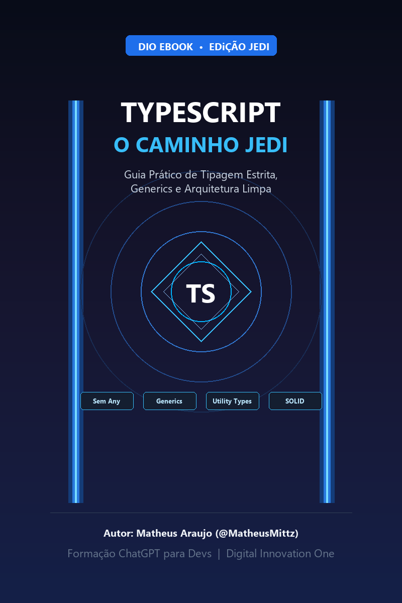

<p align="center">
    
</p>

<p align="center">
  <a href="https://dio.me/"></a>
  <a href="https://www.typescriptlang.org/"></a>
  <a href="https://openai.com/chatgpt"></a>
  <a href="https://midjourney.com/"></a>
</p>

-------

<p align="center">
  
</p>

# Projeto EBOOK: TypeScript — O Caminho Jedi

> 📌 **Projeto prático** desenvolvido no laboratório **"Criando um Ebook com ChatGPT & MidJourney"**, integrante da **Formação ChatGPT para Devs** na plataforma da [Digital Innovation One (DIO)](https://dio.me).

---

## 📖 Sobre o Projeto

O objetivo deste projeto é criar um **eBook digital completo**, unindo o poder da inteligência artificial generativa na estruturação e redação de conteúdos com a curadoria técnica humana e diagramação profissional:

- 📑 **[Baixar Versão em PDF Diagramada (PDF)](./output/ebook%20-%20typescript%20jedi.pdf)**
- 📄 **[Ler eBook Diretamente no GitHub (EBOOK.md)](./EBOOK.md)**

---

## 💻 Tecnologias e Ferramentas Utilizadas

| Ferramenta | Finalidade |
| :--- | :--- |
| **[ChatGPT](https://chat.openai.com/)** | Ideação de títulos temáticos, estruturação dos capítulos e redação didática do conteúdo |
| **[Midjourney](https://www.midjourney.com/)** | Conceituação de prompts e direção de arte para capas e estética Sci-Fi / Jedi |
| **[Python / ReportLab](https://www.reportlab.com/)** | Compilação e diagramação automática do eBook profissional em formato PDF |
| **[Python / Pillow (PIL)](https://python-pillow.org/)** | Geração e estilização da capa oficial de alta resolução |

---

## 🤖 Prompts e Engenharia de Prompt Utilizada

### 1. ChatGPT — Título e Subtítulo Épico
```text
Crie um título de um ebook sobre o tema de TypeScript, focado no nicho de programação e boas práticas de arquitetura de software. O título deve ser épico, curto e ter uma temática de Star Wars / Jedi no título. Liste 5 variações criativas.
```

*Título selecionado:*  
`TypeScript: O Caminho Jedi da Tipagem Estrita e Código Limpo`

---

### 2. ChatGPT — Conteúdo Estruturado por Capítulos
```text
Faça um texto para ebook técnico, com foco em TypeScript Avançado, abordando:
1. O perigo do uso do "any" e a alternativa com "unknown";
2. Como usar Generics para criar envelopes reutilizáveis de API;
3. Os 4 Utility Types essenciais (Partial, Pick, Omit, Record);
4. Aplicação do padrão DTO em uma Arquitetura Limpa.

{REGRAS}
- Explique sempre de maneira simples e fluida com analogias Jedi.
- Deixe o texto enxuto e direto ao ponto.
- Traga exemplos de código em contextos reais.
- Deixe um título sugestivo por tópico.
```

---

### 3. Midjourney — Direção de Arte da Capa
```text
A futuristic cybernetic Jedi holocron cube with glowing blue and cyan neon energy circuits, deep space stars background, floating geometric lightsaber reflections, volumetric cinematic lighting, 8k resolution, octane render --v 6.0 --ar 2:3
```

---

## ✨ Features do Projeto

- [x] eBook completo diagramado e exportado em [PDF de alta qualidade](./output/ebook%20-%20typescript%20jedi.pdf).
- [x] Versão em Markdown para leitura web em [EBOOK.md](./EBOOK.md).
- [x] Capa com arte em alta resolução salva em `assets/cover.png`.
- [x] Tabela de prompts documentada detalhando todo o processo criativo.

---

## 👨‍💻 Autor e Desenvolvedor

<p>
  
  <p>
    &nbsp;&nbsp;&nbsp;<b>Matheus Araujo</b><br>
    &nbsp;&nbsp;&nbsp;Desenvolvedor de Software<br>
    &nbsp;&nbsp;&nbsp;
    <a href="https://github.com/MatheusMittz">GitHub</a>&nbsp;|&nbsp;
    <a href="https://www.linkedin.com/in/">LinkedIn</a>
  </p>
</p>
<br/><br/>

---

> Projeto desenvolvido por [Matheus Araujo](https://github.com/MatheusMittz) sob a tutoria de [Felipe Aguiar](https://github.com/felipeAguiarCode) na [DIO](https://dio.me).